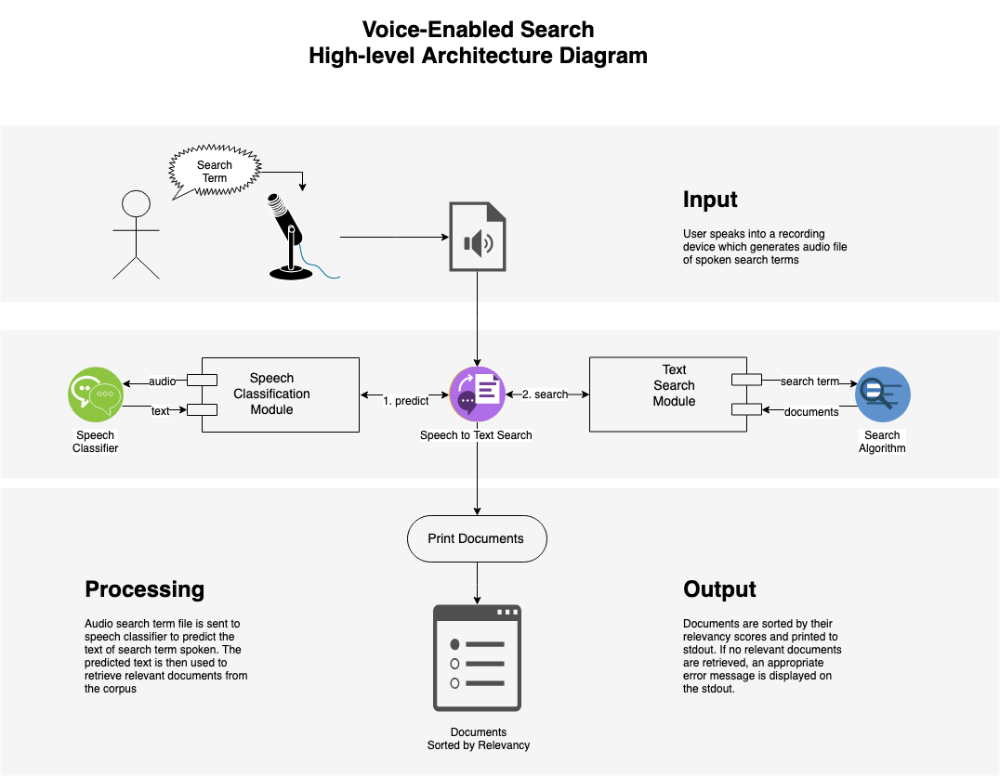
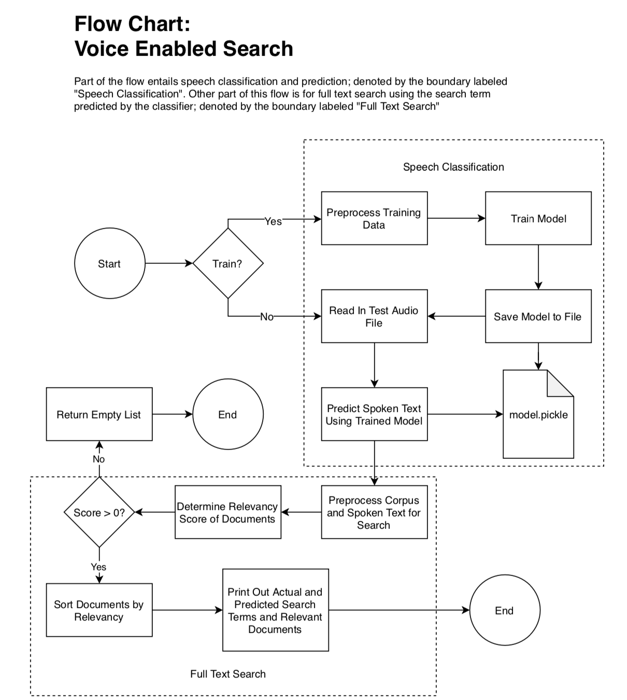

# Voice Enabled Full Text Search
###### by: Taha Amjad

### Description

This is an application which simulates a voice enabled search engine; similar to popular search engines such as Google, Bing, and others. It retrieves documents which are relevant to the words which the user has spoken.

It involves a speech classification model which needs to be trained using the training data set the first time the application runs. Once the model is trained, it can be used to predict words spoken in testing data set which are used to run full text search on a collection of documents found in the corpus.

The algorithm that is used for speech classification is Logistic Regression classifier and for full text search analysis Term Frequency/Inverse Document Frequency (TF/IDF) scores are used to find the relevant documents.   

Below is a high-level architecture diagram representing the data flow and communication between modules.




### Training and Testing Data
This application makes use of two kinds of data sets:
1. audio files of spoken words containing data for training and testing purposes saved in `./audio` and `./audio/test` directories, respectively.
    
    - There are also files containing metadata of words spoken in audio files used for training and testing saved in `./data/training_words.txt` and `./data/testing_words.txt`, respectively.
2. a corpus of text documents containing excerpts from various books and quotations along with their authors to use for full text search saved in `./data/corpus.txt`


### Prerequisites
- `Python v3.6+`
    - this application is written in `Python 3.6.0` and uses libraries compatible with this version
- `scikit-learn v0.18.1`
    - `sklearn` is used for training the speech classification algorithm and to parse documents to retrieve their relevancy scores for full text search
- `nltk v3.4`
    - `nltk` is used for text pre-processing to generate the relevancy scores of the documents in the corpus 
- `numpy v1.16.2`
    - `numpy` is used to parse audio files into multi-dimensional numeric array for training and processing
- `pydub v0.23.1`
    - audio files are read in, parsed, and split using `pydub` for pre-processing and training
- `python-speech-features v0.6`
    - function for extraction of audio features is provided by `python_speech_features`  
- `sounddevice v0.3.13`
    - `sounddevice` is used to play audio file or a chunk of audio for debugging purposes

The dependant libraries are listed in the `./requirements.txt` file and can be installed via `pip` using the following command:
```buildoutcfg
pip install -r requirements.txt
```


### Getting Started
After the `Python` environment has been set up and all the dependencies have been installed, the application can run. 

The entrypoint of the application is the `main()` function in the script called `voice_enabled_search.py`. To execute the script, run the following command in the terminal:

```buildoutcfg
python voice_enabled_search.py --search_term breakfast --train true
```

Or if training is not required:

```buildoutcfg
python voice_enabled_search.py --search_term breakfast
```

The output will be sent to `stdout` and will be visible in the terminal.

*Note:* the first time the application is executed, the `train` flag needs to be set to `True` in order for the speech classification model to be trained and be ready for predictions.


### Program Flow

The application process is as follows:
1. If the `train` flag is set to `True` the application will use the training audio files found in `./data/audio` directory to train the Logistic Regression classifier for speech classification and save the trained model for future use.
2. Next the `./data/audio/test` directory is traversed and testing audio files are used to do the following:
    1. split the audio into objects of individual spoken words
    2. the spoken words are then sent to the classifier for prediction
    3. predictions for the spoken word text are retrieved 
3. The predicted text is then sent to the search algorithm to retrieve relevant documents from the corpus; the steps of which are as follows:
    1. calculate the TF/IDF scores of the corpus
    2. sort the scores in descending order so the highest scores are at the top
    3. return the documents with scores greater than zero, sorted by highest to lowest
4. The returned documents are then printed to `stdout` along with the intended and predicted search terms



### Sample Output

###### Preprocessing...
```buildoutcfg
Data pre-processing started...
Parsing audio from file: data/audio/breakfast.wav
Data pre-processing completed
```

###### Training...
```buildoutcfg
Model trained with accuracy score on training data of 1.0
Saving the trained model object to model.pickle
```

###### Searching...
```buildoutcfg
Actual search term: "breakfast"
Predicted search term: "breakfast"

The following documents were found containing "breakfast":
1	"Why, sometimes I've believed as many as six impossible things before breakfast."
```
